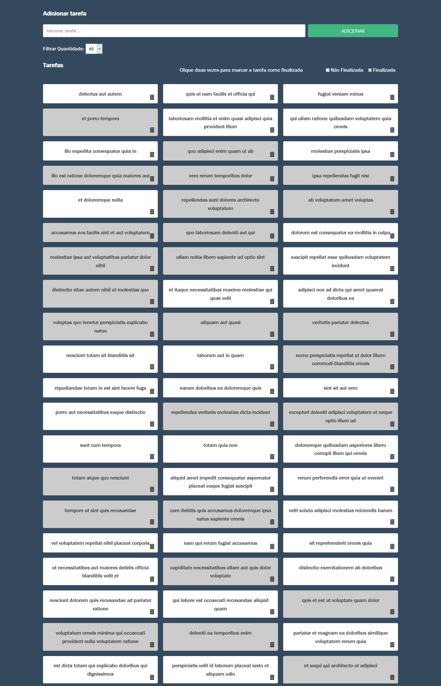

# vuex-todo-manager

## Project

***EN:*** This project is basically a fictitious task management application that can be easily implemented in a real backend, since it requests requests to the fake jsonplaceholder API. This project was built with Vue.js + Vuex for the purpose of studying these technologies.

***PT-BR:*** Este projeto é basicamente uma aplicação de gestão de tarefas fictícias que pode ser facilmente implementada em um backend real, uma vez que solicita requisições a API fake jsonplaceholder. Este projeto foi construído com Vue.js + Vuex com o propósito de estudo nestas tecnologias.

This project was developed with the following technologies:

- HTML
- CSS
- Vue.js
- Vuex
***

## Preview

***

### How To Install

To clone and run this application, you'll need Git, Node.js & NPM/Yarn installed on your computer.

From your command line:

#### Install Vuex Todo Manager

```bash
# Clone this repository
$ git clone https://github.com/gideonfernandes/vuex-todo-manager.git

# Go into the repository
$ cd vuex-todo-manager

# Install dependencies
$ npm install

# Start server
$ npm run serve

# running on port 8080
```
